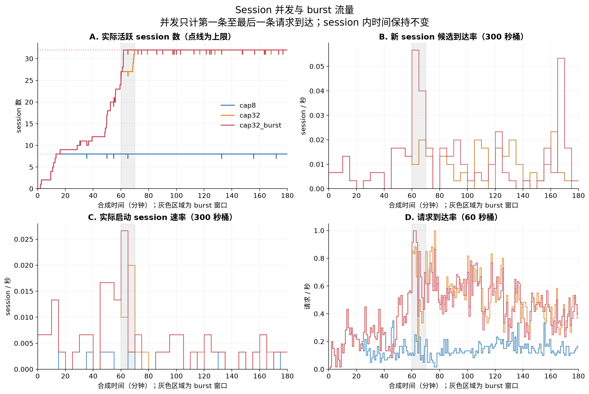

# Session 并发与 burst 验证（v2，2026-09-09）

当前使用物理到达时间，旧 load_scale 已移除。并发从第一条请求到达到最后一条请求到达后释放，不使用服务耗时。

三组实验都为 3 小时，block_size=128、seed=42、基础候选 session_rate=0.01/s、Gamma CV=1.5。burst 场景在第 60–70 分钟将候选速率设为 0.05/s。



| 场景 | 候选 session | 实际启动 | 截止待启动 | 峰值并发 | 时间平均并发 | 请求数 | 请求 RPS |
|---|---:|---:|---:|---:|---:|---:|---:|
| cap8 | 97 | 15 | 82 | 8 | 7.602 | 1,569 | 0.145 |
| cap32 | 97 | 56 | 41 | 32 | 24.541 | 4,632 | 0.429 |
| cap32_burst | 128 | 56 | 72 | 32 | 24.753 | 4,638 | 0.429 |

上限 8 和上限 32 的峰值均严格符合配置。两组基础候选时序完全一致，差异来自 session 启动准入。burst 增加候选到达，但在并发已满时主要增加待启动 session，不能越过硬上限；因此这组 burst 场景的请求数与 cap32 接近。

这里的等待只针对尚未开始的合成 session，已经到达的请求不等待服务完成，session 内时序始终保持参考数据的相对间隔。

## 验证

- 25 项 unittest 通过；固定 golden_v2 验证新调度语义，golden_v1 保留为历史数据。
- 三组共 10,839 个请求、11,070,269 个 block 通过独立源数据校验。
- 校验所有请求的 block 数、公共前缀、未缩放的 session 内相对时间和截止边界。
- 从输出请求重建活跃 session 数，验证峰值上限、末尾活跃数；从 session 生存区间独立积分验证时间平均并发。
- 确定性测试验证 burst 开始、结束和间隔剩余量跨边界传递；验证并发满时 FIFO 延后、末次请求立即释放、subagent 末次到达和零持续时间 session。
- 配置中的旧 load_scale/base_session_rate 被明确拒绝，未按兼容倍率执行。

## 来源与产物

Weka 源文件 SHA256：`5c4190caf696f8e5915c9c99bc1f698010d6c08c0225095b7da813f6210a0b50`。原始输入共 183 个 session、44,990 个请求，包含 subagent。

完整输出与参数、指纹、候选到达和并发事件保存在 `runs/weka_v2/`；绘图由 Python/Matplotlib 生成。当前代码与参数说明见根目录 README。

```bash
python3 experiments/run_weka.py --source /home/solidyang/workspace/G35/datasets/cc-traces-weka-061326/traces.jsonl --output-dir runs/weka_v2
/tmp/tracegen-plot-venv/bin/python experiments/plot_distributions.py
```
