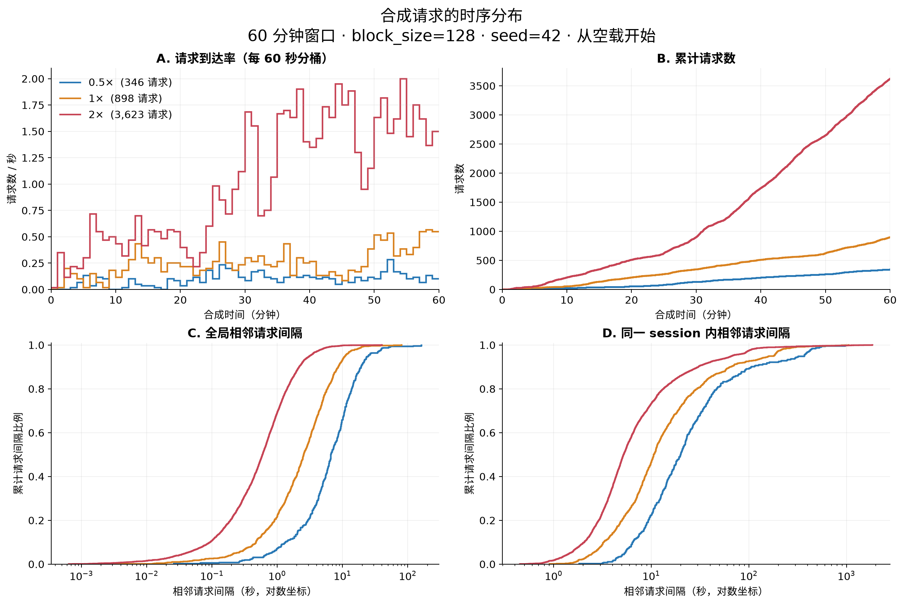
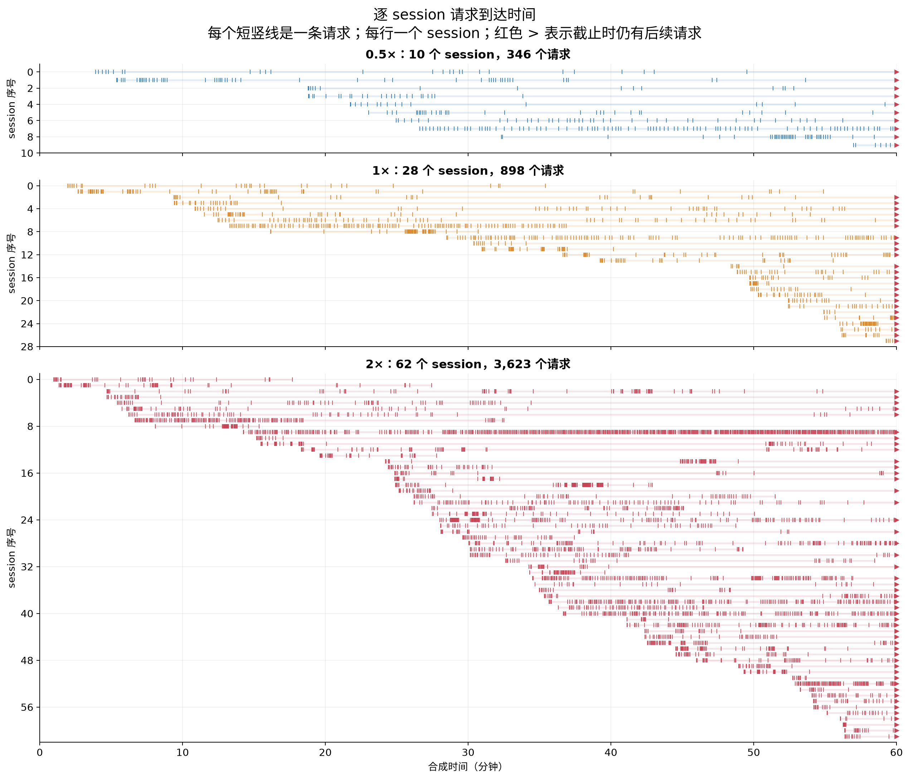

# 合成数据分布分析（2026-09-09）

分析对象是已有的三份真实 Weka 模板合成结果，未重新生成或修改 trace。三份数据均使用 `block_size=128`、输出窗口 3,600 秒、seed=42、基准 session 到达率 0.01/s、Gamma CV=1.5。分析读取全部 4,867 个请求，并核对每份输出的 SHA256、总请求数、block 数和逐 session 请求数。

## 请求时序



图 A 按 60 秒分桶，桶内请求数除以实际桶宽得到 RPS；没有平滑。图 B 为累计到达请求数。图 C、D 分别为全局相邻请求间隔与同一 session 内相邻请求间隔的经验累计分布，横轴使用对数坐标。

| load_scale | 请求数 | 平均 RPS | 60 秒桶峰值 RPS | 全局间隔 P50/P95（秒） | session 内间隔 P50/P95（秒） |
|---|---:|---:|---:|---:|---:|
| 0.5× | 346 | 0.096 | 0.283 | 6.614 / 24.189 | 19.778 / 331.153 |
| 1× | 898 | 0.249 | 0.567 | 2.540 / 10.948 | 10.572 / 170.545 |
| 2× | 3,623 | 1.006 | 2.000 | 0.594 / 3.129 | 5.194 / 67.033 |

**请求强度在窗口内明显爬升。** 0.5×、1×、2× 的最后 15 分钟 RPS 分别为最初 15 分钟的 2.775、2.549、4.035 倍。2× 从前 15 分钟的 0.384 RPS 增长到后 15 分钟的 1.551 RPS。结合生成逻辑和 session 时间线，这是空载起始、长会话持续叠加，以及本次随机采样共同形成的结果。

**存在局部波动和长尾间隔。** 60 秒桶的峰值/全窗口平均 RPS 为 2.95、2.27、1.99。1× 的 session 内间隔中位数为 10.57 秒，P95 为 170.55 秒，最大为 1,051.91 秒。全局请求由多个 session 交错组成，因此全局间隔明显短于 session 内间隔。

**Gamma 配置描述 session 起始间隔。** 三档观测 session 起始间隔 CV 分别约为 1.30、1.40、1.41；全局请求间隔 CV 分别约为 1.33、1.29、1.50。后者包含 session 模板内部时序和非平稳叠加效应，不能由起始间隔配置直接断言它也服从某个 Gamma 分布。本次只做经验分布分析，没有做分布拟合或显著性检验。

## session 之间的差异



每行表示一个合成 session，短竖线表示一次请求；浅色横线表示首个到达至模板末次到达或窗口结束之间的范围。红色 `>` 表示窗口结束时模板仍有尚未到达的请求。此图不表示设备正在执行的请求，也不表示服务端并发数。Weka 主请求和 subagent 请求都归在外层 session 中。

| load_scale | session 数 / 不同模板数 | 每 session 窗口内请求数 P50 | 请求数范围 | 被截断 session 占比 |
|---|---:|---:|---:|---:|
| 0.5× | 10 / 10 | 30 | 6–93 | 100.0% |
| 1× | 28 / 27 | 25.5 | 5–124 | 85.7% |
| 2× | 62 / 53 | 39.5 | 6–573 | 77.4% |

图中既有短时间密集请求，也有稀疏请求和长时间停顿，说明完整模板抽样保留了 session 之间的节奏差异。2× 中 `s00000009` 发出 573 个请求，占总数约 15.8%；请求数最多的 5 个 session 占总数约 32.1%。

表中每 session 请求数是窗口内观测值，受 session 启动时刻和截止截断影响，不等同于完整源 session 长度。相同模板再次被抽样时，其内部相对时序仍相同；当前版本尚未对模板内部间隔做额外重采样。

## 请求 block 数分布

| load_scale | 平均 block 数 / 请求 | P50 | P95 | 最大值 |
|---|---:|---:|---:|---:|
| 0.5× | 588.95 | 569 | 1,079 | 1,220 |
| 1× | 653.87 | 597.5 | 1,276.15 | 1,552 |
| 2× | 841.10 | 728 | 1,743 | 5,336 |

这些计数包含每个请求完整上下文中的所有完整 block，包含复用的前缀，并非新增 block 数或缓存 miss 数。乘以 128 得到完整 block 覆盖的参考 token 数；Weka 的源长度本身是 block 计数代理。

不同强度的窗口内 block 分布有所变化：2× 的单请求平均 block 数比 1× 高约 28.6%。倍率并未修改公共请求的 hash 或长度；更大的基准时间范围纳入了更多 session 和会话后段请求，观测样本也随之改变。先前的逐请求跨倍率校验已确认公共请求的 session ID 和 hash 序列一致。

## 对后续试验的影响

`load_scale` 当前严格控制整个时间轴缩放。固定 1 小时输出窗口时，0.5×、1×、2× 分别覆盖 0.5、1、2 小时基准时间，因此也包含不同数量的 session 和不同深度的后续请求。源 session 持续时间中位数约为 2.05 小时，短窗口中的截断很明显。

当前数据已经展现 session 异质性、局部突发和长尾时序，但这些结果还不能解释成稳态负载或精确目标 RPS。若要比较稳态吞吐或缓存表现，需要另行设计预热和测量窗口。若只要严格对比同一请求序列的时间缩放，可以将 `duration * load_scale` 固定，代价是各档输出持续时间不同。本次没有修改这些生成语义。

## 产物与复现

本次报告的 PNG/PDF 图表快照保存在 `experiments/figures/`，随仓库提交；重新运行分析脚本的输出位置如下。

- `runs/weka/distributions/request_timing.png` / `.pdf`：时序总览。
- `runs/weka/distributions/session_raster.png` / `.pdf`：逐 session 请求时间线。
- `runs/weka/distributions/summary.json`：统计量、定义和被分析 trace 的 SHA256。
- `runs/weka/distributions/arrival_rate_60s.csv`：60 秒桶的请求到达率。

```bash
python3 -m venv /tmp/tracegen-plot-venv
/tmp/tracegen-plot-venv/bin/python -m pip install -r experiments/requirements-plot.txt
/tmp/tracegen-plot-venv/bin/python experiments/plot_distributions.py
```

本次绘图使用 Matplotlib 3.11.1、NumPy 2.5.3。分位数使用线性插值，所以整数 block 数或请求数的分位点可能为小数；CV 使用总体标准差。间隔统计只包含窗口内实际观测到的相邻请求，未将窗口边界至首末请求的时间计作完整间隔。
